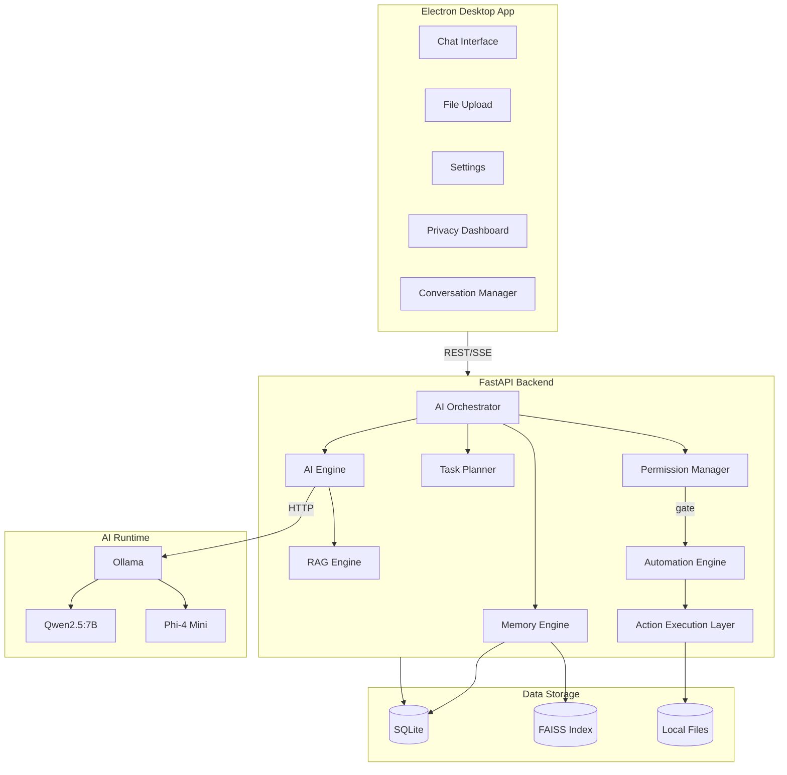

# Luna Desktop AI Assistant — Architecture Reference

> **Status:** Architecture Locked · v1.0 · July 2026
> This is the **single source of truth**. No implementation decision may contradict this document.

---

## Table of Contents
1. [Project Vision](#1-project-vision)
2. [Project Goals](#2-project-goals)
3. [Product Philosophy](#3-product-philosophy)
4. [High-Level System Architecture](#4-high-level-system-architecture)
5. [Architecture Diagram](#5-architecture-diagram)
6. [Request Workflow](#6-request-workflow)
7. [AI Processing Workflow](#7-ai-processing-workflow)
8. [Memory Workflow](#8-memory-workflow)
9. [Automation Workflow](#9-automation-workflow)
10. [Permission Workflow](#10-permission-workflow)
11. [Data Flow](#11-data-flow)
12. [Component Responsibilities](#12-component-responsibilities)
13. [Folder Structure](#13-folder-structure)
14. [Technology Stack](#14-technology-stack)
15. [Backend Architecture](#15-backend-architecture)
16. [Frontend Architecture](#16-frontend-architecture)
17. [Database Overview](#17-database-overview)
18. [Future Scalability](#18-future-scalability)
19. [Development Principles](#19-development-principles)
20. [Coding Standards](#20-coding-standards)
21. [Project Rules](#21-project-rules)

---

## 1. Project Vision

Luna is not a chatbot. Luna is an **intelligent desktop operating assistant** that understands the user's environment, remembers context across sessions, and autonomously executes actions on behalf of the user — all while running entirely on the local machine.

**North Star:** *"The assistant that lives on your machine, knows your workflow, and acts with your permission."*

---

## 2. Project Goals

| # | Goal | Priority |
|---|------|----------|
| G1 | Run 100% offline using local LLMs via Ollama | Critical |
| G2 | Maintain long-term memory across sessions | Critical |
| G3 | Execute desktop automation tasks safely | Critical |
| G4 | Provide a premium, responsive chat interface | High |
| G5 | Understand files, images, and documents | High |
| G6 | Enforce a strict permissions and privacy model | Critical |
| G7 | Keep every subsystem independently replaceable | High |
| G8 | Package as a single distributable Windows executable | Medium |

---

## 3. Product Philosophy

- **Privacy First** — All data stays on-device. No telemetry. No cloud dependency.
- **Local Intelligence** — AI inference runs on the user's hardware via Ollama.
- **Permission-Gated Actions** — No automation executes without explicit user approval.
- **Memory is a Feature** — Luna learns user preferences and past context.
- **Modular by Design** — Every subsystem is independently replaceable.
- **Production-Grade** — Clean architecture, typed interfaces, and test coverage from day one.

---

## 4. High-Level System Architecture

Luna is a **three-tier local application**:

```
PRESENTATION TIER
  Electron + React + TypeScript + TailwindCSS
  Chat UI · Settings · Privacy Dashboard · Automation Log

        ↕  HTTP / SSE (localhost:8000)

SERVICE TIER
  Python FastAPI Backend
  AI Orchestrator · Memory Engine · Automation Engine
  Permission Manager · RAG Pipeline · Task Planner

        ↕                        ↕
AI RUNTIME                  DATA TIER
  Ollama (localhost:11434)    SQLite · FAISS · Local Files
  Qwen2.5:7B / Phi-4 Mini    Conversations · Memory · Settings
```

**Key Decisions:**
- The Electron frontend talks **only** to FastAPI. It never calls Ollama directly.
- The **AI Orchestrator** is the single decision-maker for all AI operations.
- The **Permission Manager** is a mandatory gate before every automation action.
- **FAISS** handles semantic vector search; **SQLite** handles all structured data.

---

## 5. Architecture Diagram



---

## 6. Request Workflow

```
User Input
  → Frontend: Conversation Manager sends POST /api/chat/message
  → Backend: Chat Router validates (Pydantic), saves message (SQLite)
  → AI Orchestrator: classifies intent, retrieves memories, builds context
  → Route to handler:
      CHAT        → AI Engine → Ollama → SSE stream back
      AUTOMATION  → Planner → Permission Gate → Action Exec → Result
      FILE TASK   → RAG Engine → Ollama → SSE stream back
      MEMORY Q    → FAISS search → format → response
  → Save assistant response to SQLite
  → Update memory if significant
  → Stream final response to frontend
```

---

## 7. AI Processing Workflow

```
Orchestrator receives input
  → Intent Classification (Phi-4 Mini fast pass or keyword heuristic)
  → Select handler: CHAT | AUTOMATION | FILE | MEMORY
  → Context Assembly:
      system_prompt + recent_history (last N turns) + retrieved_memories
  → AI Engine calls Ollama (Qwen2.5:7B) with assembled context
  → Stream tokens back via SSE
  → Post-processing: extract actions, update memory, save response
```

**Model Selection:**
| Scenario | Model |
|----------|-------|
| General chat, reasoning, code | Qwen2.5:7B |
| Fast intent classification | Phi-4 Mini |
| File/document analysis | Qwen2.5:7B |

---

## 8. Memory Workflow

**Write path:**
```
Interaction ends → Memory Evaluator checks significance
  → Significant? YES → Embed with BAAI/bge-small-en-v1.5 (384-dim)
  → Add vector to FAISS index
  → Save raw text + metadata to SQLite memories table
```

**Read path:**
```
Incoming query → Embed query → FAISS top-5 search
  → Fetch raw text from SQLite
  → Re-rank by recency × relevance score
  → Inject into context window (max 2048 token budget)
```

---

## 9. Automation Workflow

```
Orchestrator detects automation intent
  → Task Planner decomposes into ordered steps + risk level
  → Permission Manager checks per-category approval
      Pre-approved? → Execute immediately
      Not approved? → Send permission dialog to frontend (30s timeout)
          User approves → Execute
          User denies   → Return denial message
  → Action Execution Layer dispatches to tool:
      SystemControl  (subprocess, psutil, pywin32)
      FileManager    (pathlib, shutil, watchdog)
      BrowserControl (subprocess, pyautogui)
      MediaControl   (pywin32, subprocess)
      Utilities      (pyautogui)
  → Capture result (stdout/stderr/state)
  → Write to action_logs (SQLite)
  → Return formatted result to Orchestrator for LLM summarization
```

---

## 10. Permission Workflow

```
Automation step requires permission
  → Check permissions table: is category pre-approved?
      YES → Execute
      NO  → Push permission dialog to frontend
              User selects: Allow Once | Allow Always | Deny
                Allow Always → Save to permissions table
                Allow Once   → Execute this time only
                Deny         → Return denied status
  → All decisions written to action_logs audit trail
```

---

## 11. Data Flow

| Flow | Source | Destination | Protocol |
|------|--------|-------------|----------|
| User message | React UI | FastAPI | HTTP POST |
| Streaming response | FastAPI | React UI | SSE |
| AI inference | FastAPI | Ollama | HTTP POST (11434) |
| Memory write | Memory Engine | FAISS + SQLite | In-process |
| Memory read | Memory Engine | Orchestrator | In-process |
| Automation result | Action Layer | FastAPI | In-process |
| Permission request | FastAPI | React UI | HTTP polling |
| Settings R/W | React UI | FastAPI | HTTP GET/PUT |
| File content | Filesystem | RAG Engine | pathlib |

---

## 12. Component Responsibilities

### Backend

| Component | Responsibility |
|-----------|---------------|
| AI Orchestrator | Intent routing, context assembly, response coordination |
| AI Engine | Ollama HTTP client, model selection, streaming |
| Memory Engine | Memory R/W, embedding, FAISS retrieval |
| Permission Manager | Authorization gate, audit logging |
| Task Planner | Multi-step task decomposition |
| RAG Engine | Document chunking, embedding, semantic retrieval |
| Automation Engine | Desktop action execution via OS APIs |
| Context Manager | System prompt builder, token budget enforcement |

### Frontend

| Component | Responsibility |
|-----------|---------------|
| ChatWindow | Message list, streaming token display |
| MessageBubble | Individual message formatting |
| InputBar | Text input, file attachment |
| PermissionDialog | User approval modal |
| MemoryPanel | View/manage stored memories |
| SettingsPage | Model config, permissions, personalization |
| PrivacyDashboard | Data export and deletion |
| AutomationLog | Audit trail of executed actions |

---

## 13. Folder Structure

```
luna/
├── docs/                    # All architecture documents
├── backend/
│   ├── app/
│   │   ├── main.py          # FastAPI app factory
│   │   ├── api/             # Route handlers (chat, memory, automation...)
│   │   ├── ai/              # AI Engine + Orchestrator
│   │   ├── memory/          # Memory Engine + Embeddings
│   │   ├── automation/      # Automation Engine + Tools
│   │   ├── planner/         # Task Planner
│   │   ├── rag/             # RAG Pipeline
│   │   ├── context/         # Context Builder
│   │   ├── permissions/     # Permission Manager
│   │   ├── models/          # SQLAlchemy ORM models
│   │   ├── schemas/         # Pydantic request/response schemas
│   │   ├── database/        # Engine + session factory
│   │   ├── services/        # Shared business logic
│   │   ├── plugins/         # Plugin interface
│   │   ├── tools/           # Utility tools
│   │   └── utils/           # Logging, helpers
│   ├── alembic/             # DB migrations
│   ├── tests/               # Backend tests (pytest)
│   └── requirements.txt
├── desktop/
│   ├── electron/            # Electron main process + IPC
│   ├── src/
│   │   ├── components/      # Reusable UI components
│   │   ├── pages/           # Page-level views
│   │   ├── hooks/           # Custom React hooks
│   │   ├── context/         # React Context providers
│   │   ├── services/        # API client (all fetch calls here)
│   │   ├── store/           # State management
│   │   ├── types/           # TypeScript interfaces
│   │   └── utils/           # Frontend helpers
│   ├── package.json
│   ├── tailwind.config.js
│   └── vite.config.ts
├── data/                    # Runtime data (gitignored)
│   ├── luna.db
│   ├── faiss/
│   └── uploads/
└── scripts/                 # Dev and build scripts
```

---

## 14. Technology Stack

| Layer | Technology | Purpose |
|-------|-----------|---------|
| Desktop | Electron 28+ | Desktop shell |
| UI Framework | React 18+ | Component UI |
| Language (FE) | TypeScript 5+ | Type safety |
| Styling | TailwindCSS 3+ | Utility styling |
| Build | Vite 5+ | Frontend bundler |
| Backend | Python 3.11+ | Runtime |
| API | FastAPI 0.110+ | REST + SSE |
| ORM | SQLAlchemy 2.0+ | Database access |
| Migrations | Alembic 1.13+ | Schema versioning |
| Validation | Pydantic 2.0+ | Schema enforcement |
| LLM Runtime | Ollama | Local inference |
| Primary Model | Qwen2.5:7B | General assistant |
| Secondary Model | Phi-4 Mini | Fast classification |
| Vector Search | FAISS | Semantic retrieval |
| Embeddings | BAAI/bge-small-en-v1.5 | Text vectorization |
| OS Automation | pywin32, pyautogui, psutil | Windows APIs |
| File System | watchdog, pathlib, shutil | File operations |
| Packaging | Electron Builder | Windows installer |

---

## 15. Backend Architecture

Layered architecture:
```
API Layer      →  Route handlers, Pydantic validation, SSE
Service Layer  →  Business logic orchestration
Engine Layer   →  AI, Memory, Automation, Permission engines
Infrastructure →  Database, FAISS, Ollama client, filesystem
```

**Patterns:**
- Dependency Injection via FastAPI `Depends()`
- Repository Pattern for all DB access
- Strategy Pattern for model selection
- Command Pattern for automation actions
- Observer Pattern for memory evaluation

---

## 16. Frontend Architecture

Feature-based component architecture:
```
pages/      →  Top-level routes (Chat, Settings, Privacy, Logs)
components/ →  Reusable UI components
context/    →  Global state (Conversation, Permission, Settings)
hooks/      →  Data fetching + business logic
services/   →  Centralized API client
types/      →  Interfaces mirroring backend Pydantic schemas
```

**Rules:**
- All API calls through `services/api.ts`. Never inline `fetch()` in components.
- Streaming via `EventSource` in `useChatStream` hook.
- State via React Context + `useReducer`.
- Permission dialogs via global `PermissionContext`.

---

## 17. Database Overview

> Full schema: [DATABASE.md](./DATABASE.md)

| Table | Purpose |
|-------|---------|
| `conversations` | Chat session metadata |
| `messages` | Messages per conversation |
| `memories` | Long-term memory entries |
| `embeddings_meta` | FAISS vector ID ↔ memory ID |
| `settings` | User preferences |
| `permissions` | Per-category automation approvals |
| `action_logs` | Automation audit trail |
| `uploaded_files` | RAG-processed file metadata |

**FAISS:** `IndexFlatL2`, dim=384, persisted to `data/faiss/memory.index`

---

## 18. Future Scalability

| Concern | v1 Approach | Future Path |
|---------|------------|------------|
| LLM Provider | Ollama only | Provider abstraction → cloud APIs |
| Vector DB | FAISS flat | Chroma / Qdrant |
| Database | SQLite | PostgreSQL for multi-user |
| Automation | Windows only | Abstract OS layer |
| State | React Context | Zustand / Jotai |
| Voice | Not in v1 | Whisper STT + Coqui TTS |

---

## 19. Development Principles

1. Architecture First — no code without a design decision.
2. Phase-gated — phases in TEAM_TASKS.md are sequential, never skipped.
3. Test before merge — every feature passes its checklist first.
4. Typed everything — Python type hints + TypeScript strict mode.
5. No magic strings — constants in `constants.py` / `constants.ts`.
6. Explicit over implicit — readable code over clever one-liners.
7. Single Responsibility — every module does one thing.

---

## 20. Coding Standards

> Full rules: [CODING_RULES.md](./CODING_RULES.md)

- Python: PEP 8, Black, isort, type hints required
- TypeScript: ESLint + Prettier, strict mode, no `any`
- Git: Conventional Commits (`feat:`, `fix:`, `docs:`, `chore:`)
- Branches: `main` (protected), `develop`, `feature/*`, `fix/*`, `docs/*`

---

## 21. Project Rules

1. Never call Ollama directly from the frontend.
2. Never execute automation without the Permission Manager gate.
3. Never store user data outside `data/` (gitignored).
4. Never use `SELECT *` — always specify columns.
5. Never silently swallow exceptions — log with full context.
6. Never merge to `main` with failing tests.
7. Never hardcode paths or model names — use settings/config.
8. Always validate incoming data with Pydantic before processing.
9. Always update this README when architecture changes.
10. Always write a test before fixing a bug.

---

*References: [TEAM_TASKS.md](./TEAM_TASKS.md) · [PROJECT_STRUCTURE.md](./PROJECT_STRUCTURE.md) · [API_SPEC.md](./API_SPEC.md) · [DATABASE.md](./DATABASE.md) · [WORKFLOW.md](./WORKFLOW.md) · [CODING_RULES.md](./CODING_RULES.md)*
