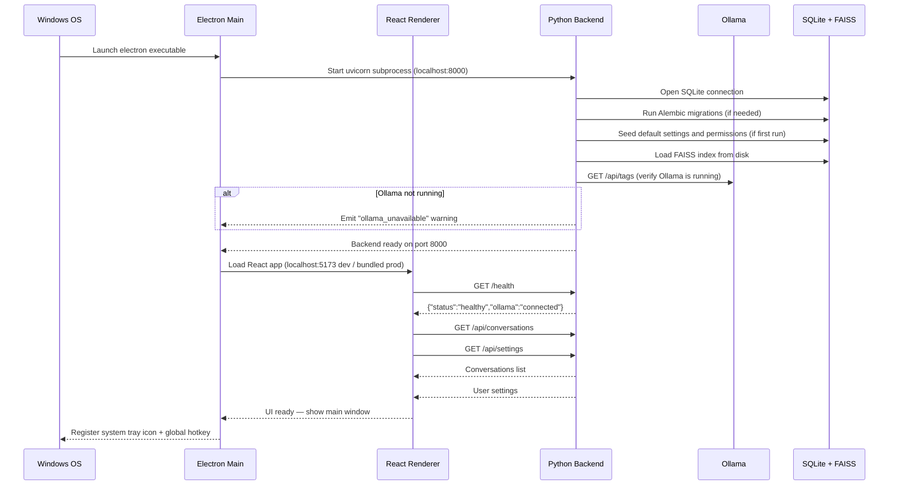
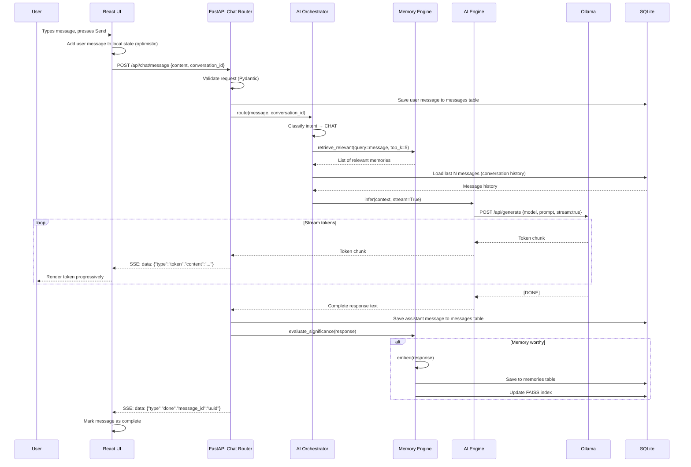
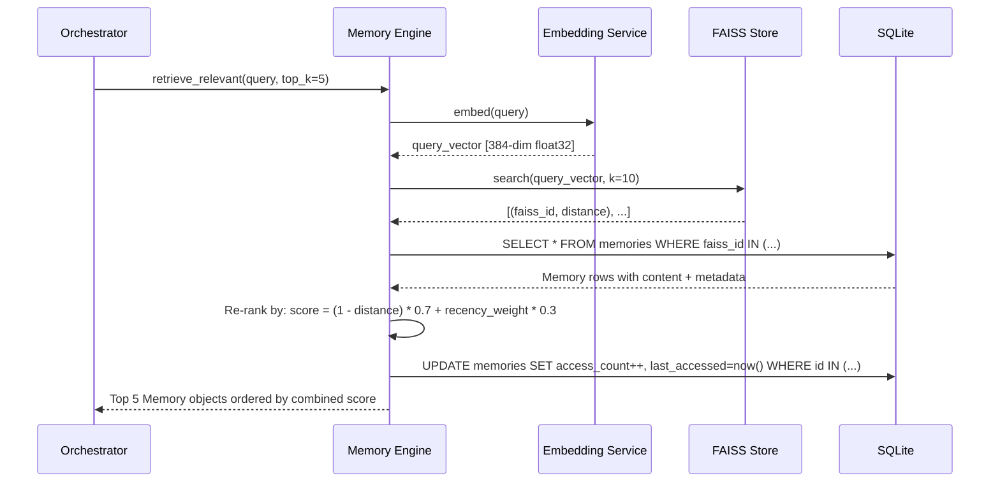
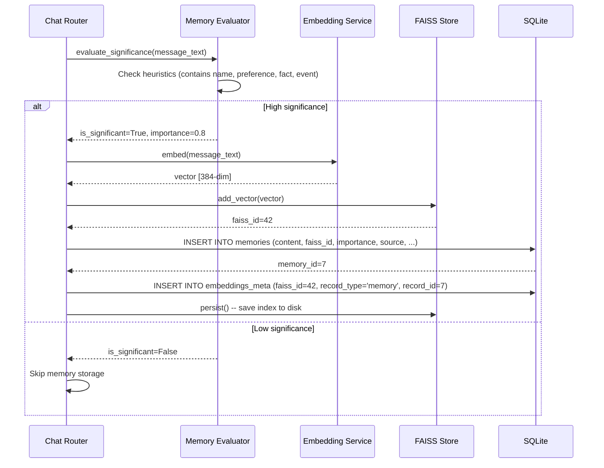
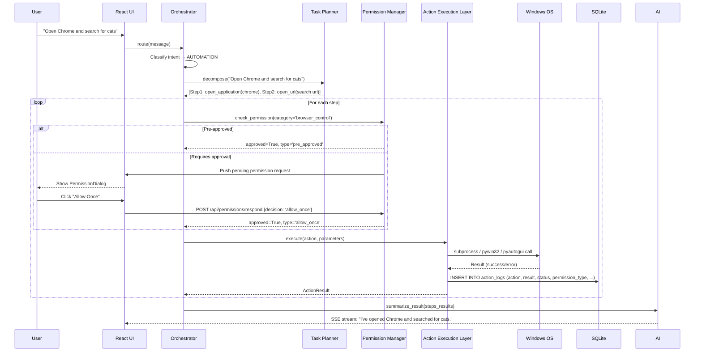
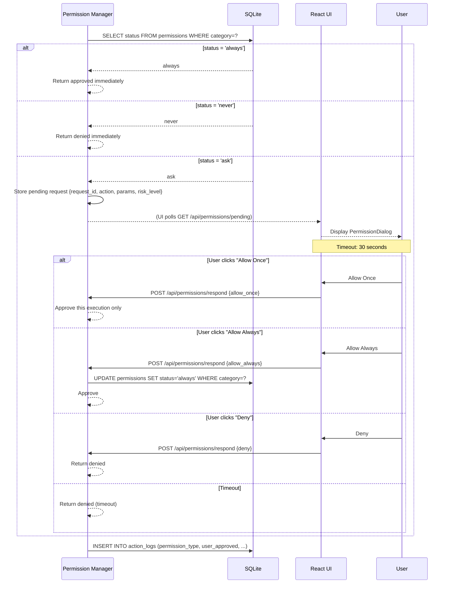
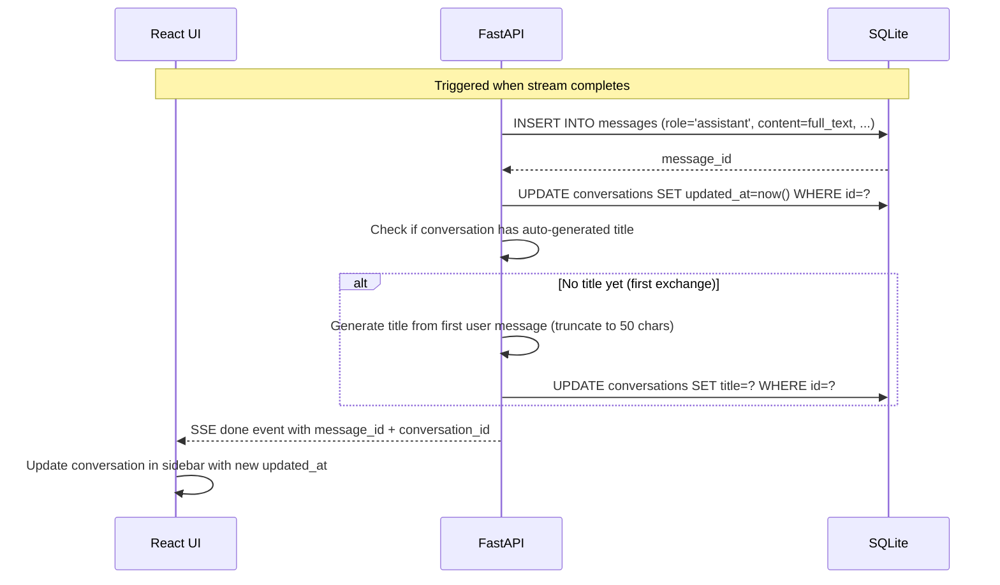
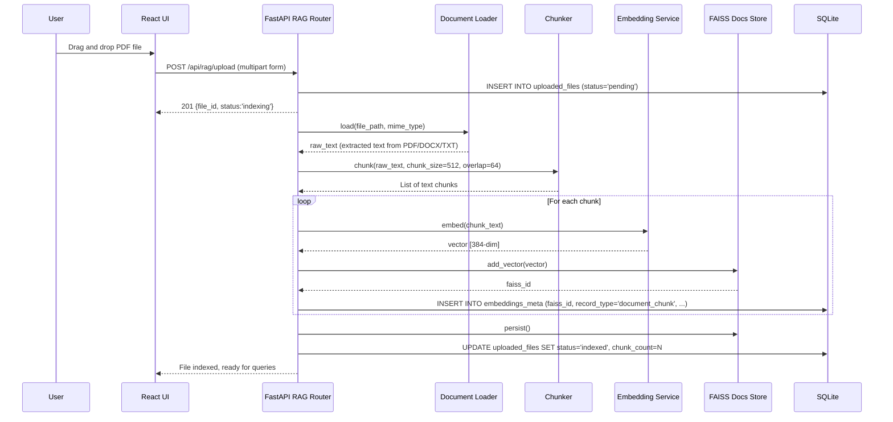
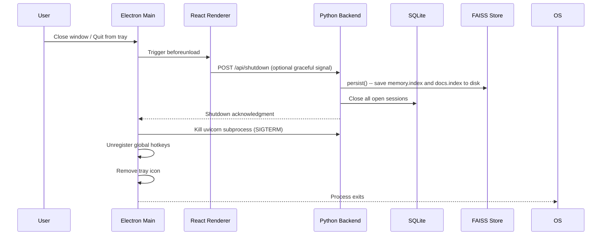

# Luna Desktop AI Assistant — System Workflows

> **Version:** 1.0 · July 2026
> All diagrams use Mermaid syntax.
> Reference: [README.md](./README.md) · [API_SPEC.md](./API_SPEC.md) · [DATABASE.md](./DATABASE.md)

---

## 1. Application Startup Flow

---

## 2. Chat Request & Streaming Response Flow

---

## 3. Memory Retrieval Flow

---

## 4. Memory Write Flow

---

## 5. Desktop Automation Flow

---

## 6. Permission Approval Flow

---

## 7. Conversation Save Flow

---

## 8. RAG Document Processing Flow

---

## 9. Application Shutdown Flow

---

*References: [README.md](./README.md) · [API_SPEC.md](./API_SPEC.md) · [DATABASE.md](./DATABASE.md)*
